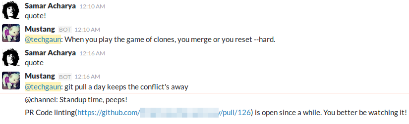

# ex_mustang

> A simple, clueless bot


ExMustang is a bot for Slack written in Elixir. While ExMustang is written for Slack, the responder modules should work fine with other Hedwig adapters as well.

_Warning: This is a work in progress._



### Setup

Create a Slack bot user from [here](https://my.slack.com/services/new/bot). You will receive an API token you can use. Set the `SLACK_API_TOKEN` environment variable and you should be good to go.

You can run this bot as below:

```shell
export SLACK_API_TOKEN="<SLACK_API_TOKEN>"
mix run --no-halt
```

A sample runner configuration looks like below:

```shell
export SLACK_API_TOKEN="<SLACK_API_TOKEN<"
export GITHUB_TOKEN="<GITHUB_TOKEN>"
export GOOGLE_API_KEY="<GOOGLE_API_KEY>"
export STANDUP_CHANNEL="scrum"
export GH_CHANNEL="github"
export PWN_CHANNEL="critical"

mix run --no-halt
```

### Scheduled Notifications

#### Github Pull Requests Watcher

You can configure github token by setting `GITHUB_TOKEN`. Also, you can pass list of repos to watch by updating [config](config/config.exs#L11-L17). There are bunch of other stuffs you can configure such as schedule (which follows cron format), slack channel and thresholds.

#### Standup Reminder

The standup reminder reminds us when its standup time. Our nature is that we either forget track of time or are too lazy to remember about it. This does not make you better at attending standup but is more of a satire for us. You can configure message and other bunch of stuffs on [config](config/config.exs#L5-L9)

#### Have I Been Pwned Checker

The hibp checker can check list of accounts against [haveibeenpwned.com](https://haveibeenpwned.com)
by using [ExPwned](https://github.com/techgaun/ex_pwned). You can set the appropriate configuration on config.exs.

```elixir
# config below runs hibp check once a day and posts if any found breach to configured slack channel
config :ex_mustang, ExMustang.Responders.Pwned,
  schedule: "0 * */1 * *",
  enabled: true,
  accounts: [
    "abc@example.com",
    "def@example.com"
  ],
  slack_channel: System.get_env("PWN_CHANNEL") || "general"
```

#### Uptime Monitoring

ExMustang supports simple uptime monitoring and can perform periodic uptime checks against given set of endpoints.
The config block looks like below:

```elixir
config :ex_mustang, ExMustang.Responders.Uptime,
  schedule: "*/5 * * *",
  enabled: true,
  endpoints: [
    [
      uri: "https://api.brighterlink.io/status", status_code: 200, content: ~s("msg":"ok"), method: "GET",
      content_type: "application/json", req_headers: [{"User-Agent", "ExMustang"}], timeout: 20_000
    ]
  ],
  slack_channel: System.get_env("UPTIME_CHANNEL") || "general"
```

The `endpoints` section is where you define the endpoints you're willing to perform uptime check against.

- `uri` - the endpoint to hit
- `status_code` - expected status code
- `content` - expected response body content (supports both string and regular expression)
- `method` - one of `GET`, `POST`, `PUT`, `PATCH` and `DELETE`
- `body` - body to send as part of `POST`, `PUT` or `PATCH` requests
- `content_type` - expected content type header value
- `req_headers` - list of tuples of request headers to send
- `timeout` - maximum timeout before request fails

### Responders

Currently, there are following responders and these should ideally work with any Hedwig adapters:

- `ExMustang.Responders.GMap` - gives you google maps search result for your search queries.
- `ExMustang.Responders.Pwned` -
- `ExMustang.Responders.Quote` - gives you random funny quote
- `ExMustang.Responders.Slap` - slaps another user
- `ExMustang.Responders.Time` - gives time on given timezone (without timezone, uses local timezone of machine ExMustang is running on)

For Google Maps search, you have to set `GOOGLE_API_KEY` which has access to call google places api.

```shell
mustang help - Displays all of the help commands that mustang knows about.
mustang help <query> - Displays all help commands that match <query>.
gmap <search_term> - Replies with the information from google places/maps.
pwned <search_account> - Checks to see if an account has been breached or not
quote - Replies with a random quote.
slap - Slaps the user. Format: slap <username> | me
time - get time in a given timezone
```

### About Mustang

Mustang (pronounced like `moostang` not like the `Ford Mustang`; I don't know phonetics) is my best friend whom I had to leave back in Nepal. After surviving [April 2015 Earthquake](https://en.wikipedia.org/wiki/April_2015_Nepal_earthquake), we lived together for a while and I had to leave him back in Nepal. Below is the pic post-earthquake.


