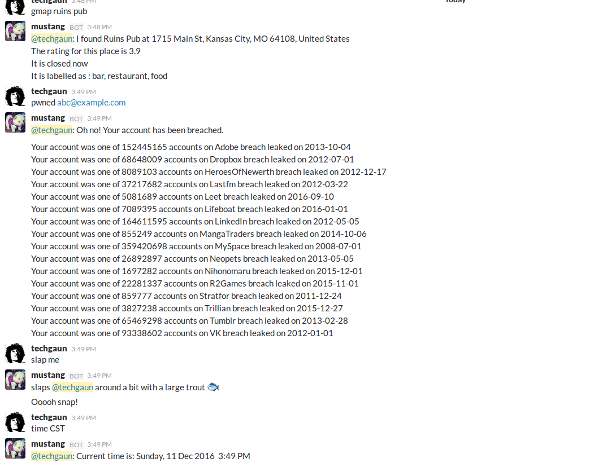
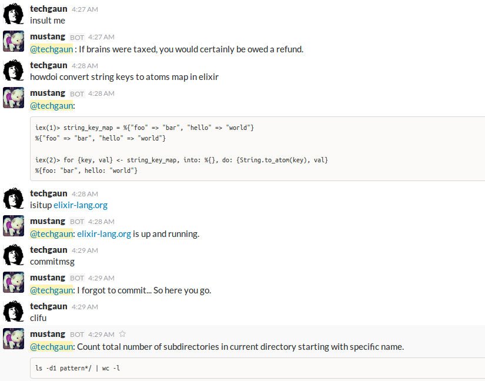

# ex_mustang

> A simple, clueless bot


ExMustang is a bot for Slack written in Elixir. While ExMustang is written for Slack, the responder modules should work fine with other Hedwig adapters as well. If you like Mustang, please use [Mustang](images/mustang.jpg) as bot image if possible :)

_Warning: This is a work in progress._






### Setup

Create a Slack bot user from [here](https://my.slack.com/services/new/bot). You will receive an API token you can use. Set the `SLACK_API_TOKEN` environment variable and you should be good to go.

You can run this bot as below:

```shell
export SLACK_API_TOKEN="<SLACK_API_TOKEN>"
mix run --no-halt
```

A sample runner configuration looks like below:

```shell
export SLACK_API_TOKEN="<SLACK_API_TOKEN<"
export GITHUB_TOKEN="<GITHUB_TOKEN>"
export GOOGLE_API_KEY="<GOOGLE_API_KEY>"
export STANDUP_CHANNEL="scrum"
export GH_CHANNEL="github"
export PWN_CHANNEL="critical"
export UPTIME_CHANNEL="critical"
export SLACK_INVITEALL_TOKEN="<SLACK_INVITEALL_TOKEN>"

mix run --no-halt
```

For using `ex_mustang` with multiple slack teams, you can use `MIX_ENV` by creating config files such as `yourteam.exs`
and run as `MIX_ENV=yourteam mix run --no-halt`

### Scheduled Notifications

#### Github Pull Requests Watcher

You can configure github token by setting `GITHUB_TOKEN`. Also, you can pass list of repos to watch by updating [config](config/config.exs#L11-L17). There are bunch of other stuffs you can configure such as schedule (which follows cron format), slack channel and thresholds.

#### Standup Reminder

The standup reminder reminds us when its standup time. Our nature is that we either forget track of time or are too lazy to remember about it. This does not make you better at attending standup but is more of a satire for us. You can configure message and other bunch of stuffs on [config](config/config.exs#L5-L9)

#### Have I Been Pwned Checker

The hibp checker can check list of accounts against [haveibeenpwned.com](https://haveibeenpwned.com)
by using [ExPwned](https://github.com/techgaun/ex_pwned). You can set the appropriate configuration on config.exs.

```elixir
# config below runs hibp check once a day and posts if any found breach to configured slack channel
config :ex_mustang, ExMustang.Responders.Pwned,
  schedule: "0 * */1 * *",
  enabled: true,
  accounts: [
    "abc@example.com",
    "def@example.com"
  ],
  slack_channel: System.get_env("PWN_CHANNEL") || "general"
```

#### Uptime Monitoring

ExMustang supports simple uptime monitoring and can perform periodic uptime checks against given set of endpoints.
The config block looks like below:

```elixir
config :ex_mustang, ExMustang.Responders.Uptime,
  schedule: "*/5 * * *",
  enabled: true,
  endpoints: [
    [
      uri: "https://api.brighterlink.io/status", status_code: 200, content: ~s("msg":"ok"), method: "GET",
      content_type: "application/json", req_headers: [{"User-Agent", "ExMustang"}], timeout: 20_000
    ]
  ],
  slack_channel: System.get_env("UPTIME_CHANNEL") || "general"
```

The `endpoints` section is where you define the endpoints you're willing to perform uptime check against.

- `uri` - the endpoint to hit
- `status_code` - expected status code
- `content` - expected response body content (supports both string and regular expression)
- `method` - one of `GET`, `POST`, `PUT`, `PATCH` and `DELETE`
- `body` - body to send as part of `POST`, `PUT` or `PATCH` requests
- `content_type` - expected content type header value
- `req_headers` - list of tuples of request headers to send
- `timeout` - maximum timeout before request fails

#### Random Quote of the Day

ExMustang can send a quote as specified in schedule. You can configure schedule from config.exs
and you can specify `QUOTE_CHANNEL` env-var. If `QUOTE_CHANNEL` is not specified, the quotes are
sent to `general` channel by default.

### Responders

Currently, there are following responders and these should ideally work with any Hedwig adapters:

- `ExMustang.Responders.GMap` - gives you google maps search result for your search queries.
- `ExMustang.Responders.Pwned` -
- `ExMustang.Responders.Quote` - gives you random funny quote
- `ExMustang.Responders.Slap` - slaps another user
- `ExMustang.Responders.Time` - gives time on given timezone (without timezone, uses local timezone of machine ExMustang is running on)
- `ExMustang.Responders.TimeConvert` - converts given unix timestamp to ISO8601 format
- `ExMustang.Responders.EncodeDecode` - encoding/decoding tools
- `ExMustang.Responders.Isup` - checks if a site is up or not via isitup.org API
- `ExMustang.Responders.RandomInsult` - insults a user with random insults from randominsults.net
- `ExMustang.Responders.HTTPCat` - gets a cat for corresponding http status code
- `ExMustang.Responders.Howdoi` - tries to find answer for programming questions
- `ExMustang.Responders.CommitMsg` - Get random commit messages from http://whatthecommit.com/index.txt
- `ExMustang.Responders.CLIFu` - Gets clifu gems from http://www.commandlinefu.com
- `ExMustang.Responders.Whois` - performs a whois query using https://dnsquery.org
- `ExMustang.Responders.GitTip` - get a random git tip (with support for keywords)
- `ExMustang.Responders.Birthday` - send a happy birthday to the mentioned user
- `ExMustang.Responders.InviteAll` - invite all members (of optionally given channel)

For Google Maps search, you have to set `GOOGLE_API_KEY` which has access to call google places api.

```shell
mustang help - Displays all of the help commands that mustang knows about.
mustang help <query> - Displays all help commands that match <query>.
gmap <search_term> - Replies with the information from google places/maps.
pwned <search_account> - Checks to see if an account has been breached or not
quote - Replies with a random quote.
slap - Slaps the user. Format: slap <username> | me
time - get time in a given timezone
unix2iso <unix_timestamp> - Converts given unix timestamp to ISO format (Auto-replies for values that look like timestamps)
b64encode <content> - base64 encoding of given text content
b64decode <content> - base64 decoding of given text content
isitup <domain> - checks if given domain is up or not
insult me|<username> - insults given username with random insults
httpcat <status_code> - get http status code cat for given value
howdoi <query> - tries to find solution on the given query
commitmsg - get a random commit message
clifu [search_word] - get clifu gem (gives random clifu if no keyword is passed)
whois <domain> - gives whois query for given domain
gittip [keyword] - Get a random git tip for given keyword
happy birthday <me|@user> - Send happy birthday message to the user mentioned
hdeploy <app-name> - Deploys configured branch to the given app
inviteall [src_channel] - invite all the members of source channel
```

#### Heroku Deployment

For heroku deployment to work, you need to specify the following configurations:

- `HEROKU_GITHUB_TOKEN` or `GITHUB_TOKEN`
- `HEROKU_TOKEN` which is an API key you can get from [here](https://dashboard.heroku.com/account)
- mapping of apps in your config which is a tuple of heroku app name and map of repo and branch

An example config looks like below:

```elixir
config :ex_mustang, ExMustang.Responders.HerokuDeploy,
  github_token: System.get_env("HEROKU_GITHUB_TOKEN") || System.get_env("GITHUB_TOKEN"),
  token: System.get_env("HEROKU_TOKEN"),
  apps: [
    {"casa-core-stage", %{repo: "casaiq/core", branch: "master"}}
  ]
```

#### InviteAll Responder

The invite all responder requires you to provide a token of a non-bot and non-guest slack team member because thats how the slack api works. You can get your personal tokens from [HERE](https://api.slack.com/custom-integrations/legacy-tokens)

### Changelog

The detail changelog is available [HERE](CHANGELOG.md)

### About Mustang

Mustang (pronounced like `moostang` not like the `Ford Mustang`; I don't know phonetics) is my best friend whom I had to leave back in Nepal. After surviving [April 2015 Earthquake](https://en.wikipedia.org/wiki/April_2015_Nepal_earthquake), we lived together for a while and I had to leave him back in Nepal. Below is the pic post-earthquake.


